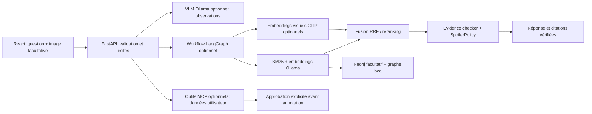

# NarrativeLens

**Assistant intelligent multimodal et agentique pour l’analyse de livres**

NarrativeLens fait évoluer Literary Chat sans remplacer son moteur de lecture : questions en français ou en anglais, recherche hybride locale BM25 + embeddings, citations vérifiées, progression de lecture et graphe de personnages restent disponibles. Une image facultative peut maintenant accompagner une question sur une page, une illustration, une carte ou une planche.

Les observations d’image servent à guider la recherche. Elles ne deviennent pas des faits sans preuve trouvée dans les passages du livre. La génération conserve les citations textuelles vérifiées et la limite de chapitre.

## Fonctionnalités

- Import EPUB, TXT, Markdown, PDF avec texte et DOCX.
- Extraction locale d’images intégrées EPUB, PDF et DOCX, avec identifiant, livre, repère de chapitre/page, légende, contexte, OCR disponible et chemin local.
- Chat texte historique conservé, avec BM25, embeddings Ollama, fusion RRF, graphe et réponse extractive de secours.
- Question texte + image JPG, PNG ou WebP, prévisualisation, analyse VLM optionnelle et observations marquées comme incertaines.
- Recherche visuelle par embeddings image/texte CLIP multilingues en option. Les vecteurs sont mis en cache localement. Sans cette option, les questions texte continuent de fonctionner; les citations visuelles ne sont pas produites.
- Règle centrale anti-spoiler appliquée aux passages, relations et visuels récupérés.
- Progression, conversations et annotations locales; authentification JWT activable, stockage séparé par utilisateur pour ces données.
- Annotation préparée puis affichée exactement avant approbation; jeton lié au texte et aux preuves, sauvegarde idempotente.
- Serveur MCP optionnel pour la progression, les métadonnées et les annotations avec confirmation.
- Workflow LangGraph optionnel; chemin Python direct compatible si LangGraph n’est pas installé.
- Cross-encoder multilingue optionnel et scripts pour construire un jeu réel, entraîner et évaluer un reranker.

## Architecture



Le détail des chemins exécutables et de leurs limites est dans [docs/architecture.md](docs/architecture.md), [docs/multimodal-rag.md](docs/multimodal-rag.md), [docs/langgraph-workflow.md](docs/langgraph-workflow.md), [docs/mcp.md](docs/mcp.md), [docs/security.md](docs/security.md), [docs/reranker-training.md](docs/reranker-training.md) et [docs/evaluation.md](docs/evaluation.md).

## Installation locale

Prérequis : Python 3.11+, Node.js 20+, npm et Ollama. Sous PowerShell :

```powershell
python -m venv .venv
.\.venv\Scripts\Activate.ps1
python -m pip install -e ".[dev,legacy-ui]"
Copy-Item .env.example .env
ollama pull qwen3.5:4b-q4_K_M
ollama pull qwen3-embedding:0.6b
literary-library embeddings
```

Le VLM est facultatif. Pour l’analyse locale d’images :

```powershell
ollama pull qwen3.5:4b-q4_K_M
```

Pour les embeddings visuels et OCR local, installer seulement les extras nécessaires :

```powershell
python -m pip install -e ".[visual]"
$env:VISUAL_EMBEDDINGS = "clip"
python -m pip install -e ".[ocr]"
$env:OCR_ENABLED = "true"
```

L’extra OCR installe le client Python. Tesseract OCR doit également être installé sur le système et accessible dans `PATH`. L’OCR n’est lancé que sur des pages PDF sans texte exploitable, et seulement si `OCR_ENABLED=true`.

## Lancer l’application

Pour démarrer l’API et l’interface ensemble, depuis la racine :

```powershell
python scripts/dev.py
```

Le lanceur réutilise les serveurs déjà actifs. `Ctrl+C` arrête uniquement ceux qu’il a démarrés. Cela évite de lancer Vite seul et d’obtenir une erreur de proxy sur le port 8000.

Pour les lancer séparément :

Terminal 1, racine du dépôt :

```powershell
python -m uvicorn app.api:app --host 127.0.0.1 --port 8000
```

Terminal 2 :

```powershell
cd web
npm install
npm run dev
```

Ouvre `http://127.0.0.1:5173`. L’API et ses schémas sont sur `http://127.0.0.1:8000/docs`. Pour la version servie par FastAPI : `cd web; npm run build; cd ..; python -m uvicorn app.api:app --host 127.0.0.1 --port 8000`.

Active l’authentification dans `.env` avec `AUTH_ENABLED=true` et un `JWT_SECRET` aléatoire d’au moins 32 caractères; `APPROVAL_SECRET` permet d’utiliser une clé distincte pour les approbations. Génère une clé temporaire de session PowerShell avec `$env:JWT_SECRET = [Convert]::ToBase64String([Security.Cryptography.RandomNumberGenerator]::GetBytes(32))`. Les comptes locaux se créent depuis l’écran de connexion; l’API expose aussi `/api/auth/register` et `/api/auth/login`. Sans cette option, le mode local historique reste actif.

## Import et questions multimodales

Depuis **Ajouter un livre**, importe un EPUB/PDF/DOCX contenant texte et images. Les images extraites restent dans `data/library/visuals`; leurs métadonnées sont dans `data/processed/*.visuals.json`. Les pages PDF gardent leurs numéros physiques. Pour une BD, chaque page image est l’unité visuelle; la segmentation des cases n’est pas faite.

Dans la discussion, joins un JPG, PNG ou WebP (10 Mo par défaut) et pose une question, par exemple :

- « Explique cette page sans me spoiler après le chapitre 5. »
- « Cette illustration peut-elle correspondre à une scène que j’ai déjà lue ? »
- « Quels indices du passage accompagnant cette carte aident à la lire ? »

Le VLM local par défaut est configuré par `VLM_PROVIDER` et `VLM_MODEL`. Sans VLM, la question textuelle est quand même traitée et l’interface indique l’absence d’analyse visuelle. Pour chercher une image dans les visuels du livre par similarité, active `[visual]` et `VISUAL_EMBEDDINGS=clip`; le premier passage calcule les vecteurs puis les conserve dans `data/library/visual_embeddings`. Ce modèle joint image/texte est séparé des observations du VLM.

## Services optionnels

Neo4j reste facultatif; lance-le avec `docker compose up -d neo4j` après avoir défini `NEO4J_PASSWORD`. Le graphe local continue sans Neo4j.

`QDRANT_*`, `POSTGRES_*` et `MLFLOW_*` sont réservés pour une évolution future : ces services ne sont pas encore raccordés au runtime et ne sont pas ajoutés au Compose. Le stockage actuel reste le système de fichiers local. Ollama s’exécute sur l’hôte, ce qui évite les contraintes GPU de Docker sous Windows.

Extras optionnels supplémentaires : `.[orchestration]` pour LangGraph, `.[mcp]` pour le SDK MCP et `.[training]` pour les outils d’entraînement. Les absences de ces paquets ne bloquent pas le serveur.

## MCP et annotations

Le serveur stdio s’exécute avec `narrativelens-mcp` après `python -m pip install -e ".[mcp]"`. Il propose les outils de lecture de progression, annotations, métadonnées, préparation et sauvegarde d’annotations. Définis `NARRATIVELENS_DATA_DIR` et `NARRATIVELENS_USER_ID` pour le profil local du serveur. La sauvegarde exige le jeton correspondant au contenu exact; un changement impose une nouvelle préparation. Le frontend utilise les routes locales FastAPI qui appellent le même service d’annotation.

## Reranker et évaluation

Le reranker par défaut est la diversification déterministe déjà présente. Pour essayer le cross-encoder pré-entraîné, installe l’extra `.[training]`, puis configure `RERANKER_PROVIDER=cross_encoder`. Pour un modèle entraîné, configure `RERANKER_PROVIDER=trained` et `RERANKER_PATH`.

Le jeu JSONL contient une question, un passage positif et des hard negatives :

```powershell
python training/build_dataset.py .\training\examples.jsonl .\data\library\reranker-train.jsonl
python training/train_reranker.py .\data\library\reranker-train.jsonl --base-model cross-encoder/mmarco-mMiniLMv2-L12-H384-v1 --output .\models\reranker --epochs 2
python training/evaluate_reranker.py .\data\library\ranking-candidates.jsonl --output .\data\library\reranker-evaluation.json
python -m rag.evaluate --output data/library/evaluation-latest.json
```

Aucun entraînement ni score de benchmark n’est inclus ou prétendu. Les scripts écrivent uniquement les résultats mesurés sur les données fournies.

## Tests et vérifications

```powershell
python -m pytest -q
cd web
npm run build
```

Les tests mockent les providers d’image et n’ont besoin ni de VLM, ni de CLIP, ni de Neo4j. Les appels réels aux modèles nécessitent les modèles correspondants dans Ollama; l’index visuel requiert son extra et son premier calcul d’embeddings.

## Structure

- `src/ingestion` : chargeurs, extraction visuelle, OCR optionnel et découpage.
- `src/retrieval` : BM25, embeddings, graphe, SpoilerPolicy, retrieval visuel et fusion.
- `src/vision` : provider VLM et sorties structurées d’observations.
- `src/reranking`, `training` : cross-encoder optionnel, données et entraînement.
- `src/workflows` : graphe de conversation LangGraph optionnel et fallback direct.
- `src/mcp_server`, `src/security` : outils MCP, approbation, comptes et jetons.
- `src/rag`, `src/catalog`, `src/graph`, `src/storage` : moteur existant, bibliothèque, graphe et persistance locale.
- `app/api.py` : API FastAPI.
- `web/src` : interface React/TypeScript.
- `tests` : suite pytest.

## Limites connues

Qdrant, PostgreSQL et MLflow sont des variables de configuration réservées et ne participent pas au runtime actuel. Le client FastAPI appelle le serveur MCP stdio lorsque MCP_TRANSPORT=stdio ; le mode direct reste disponible. L’authentification est un prototype local avec création de compte ouverte; elle n’a pas de limitation de débit. Les routes de conversation limitent les appels Ollama/MCP, le temps restant des appels réseau et la concurrence. Les traitements locaux bloquants ne sont pas interrompus de force. Le reranker entraîné nécessite un jeu réel construit par l’utilisateur et un entraînement effectif. Les relations du graphe sont encore principalement des relations de personnages issues du texte.

## Correspondance au sujet pédagogique

Consulter [l’audit des 14 rubriques](docs/project-alignment.md), le [profil de démonstration](docs/demo-profile.md) et le PDF `output/pdf/NarrativeLens_Projet_IA_Generative_Multimodale.pdf`.
